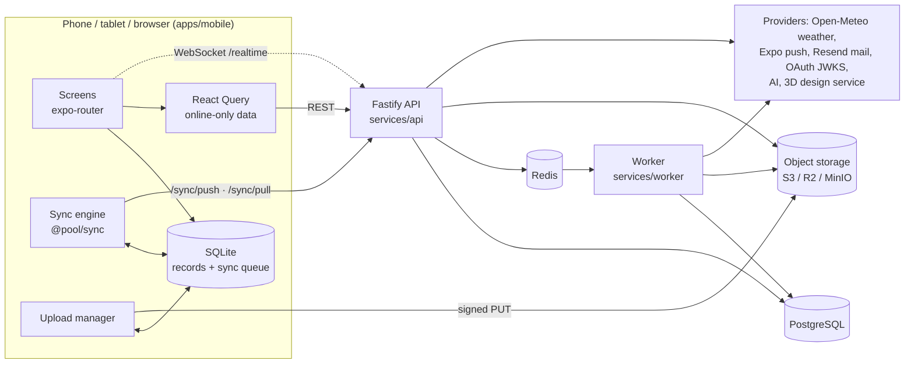
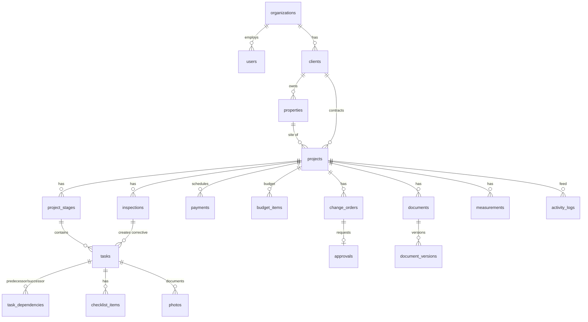

# Architecture

## System overview

- **The device database is the source of truth for what the user sees.** Field screens read only from local SQLite, so they behave the same online and offline. The sync engine moves changes in both directions.
- Office-only data that has no offline story is fetched live with React Query. This covers reports, dashboards' server aggregates, approvals and search.
- Realtime is an optimisation. A WebSocket hint triggers a sync or refetch, and nothing depends on it being connected.

## Monorepo

npm workspaces and Turborepo. Internal packages ship **TypeScript source** (`"main": "./src/index.ts"`): Metro, Vitest and tsx consume them directly with no build step, and the API and worker are bundled with tsup, which inlines `@pool/*` and keeps third-party packages external.

| Workspace | Purpose | Used by |
|---|---|---|
| `packages/types` | Enums (roles, statuses, categories), entity interfaces, API envelope, sync protocol types | everything |
| `packages/validation` | zod DTO schemas, the single source of truth for request shapes | app, API |
| `packages/config` | Cross-cutting constants: upload limits, photo sizes, environments | app, API, validation |
| `packages/core` | Pure domain logic: calendar, CPM scheduling, permissions, budget, change orders, checklist rule, stages, weather rules | app, API, database seed |
| `packages/sync` | `SyncEngine` with pluggable queue, local store, transport and network monitor | app |
| `packages/database` | Drizzle schema, SQL migrations, seed, tenant delete | API, worker, tests |
| `packages/api-client` | Fetch wrapper: envelope, typed errors, single-flight token refresh, signed upload helper | app |
| `packages/ui` | Design tokens: palette (light/dark), tone maps, contrast checks | app |
| `apps/mobile` | Expo app for iOS, Android and web | — |
| `services/api` | REST + WebSocket API | worker (imports its services and adapters) |
| `services/worker` | BullMQ consumer and schedulers | — |
| `e2e` | Playwright web E2E, Maestro native flows | — |

**Why there is no `apps/web`.** The Expo app's web export is the browser/admin interface. Every screen, including team, roles, vendors, integrations and reports, is responsive (phone, tablet, desktop widths), so office staff use the same app in a browser. A separate web codebase would duplicate the UI, validation and permission logic for no product gain. If a marketing site or a heavy desktop-only tool is needed later, it can be added as `apps/web` and reuse `@pool/api-client`, `@pool/validation` and `@pool/ui`.

## Key decisions

| Decision | Why |
|---|---|
| **Fastify + Drizzle + PostgreSQL** | Typed SQL close to the metal; migrations are plain reviewed SQL files; Postgres gives transactions, advisory locks, sequences and JSONB, which the sync protocol needs. |
| **Shared zod DTOs** | The app validates forms with the exact schemas the server enforces. `patchOf()` builds PATCH schemas without defaults, so a partial update never resets omitted fields. |
| **Offline-first SQLite with a generic `records` table** | One table keyed by `(type, id)`, with indexed `project_id` / `parent_id` / `sort_key` and the JSON record. Adding a synced entity needs no device migration. Queries are simple, and screens get live updates through change notifications (`useLocalQuery`). |
| **React Query only for online-only data** | It avoids two caches for the same entity. Synced entities come from SQLite only. |
| **Adapters for every external dependency** | `services/api/src/adapters`. Each one has a dev implementation so local development and tests need no accounts. Selected by env in `container.ts`. |
| **Jobs inline without Redis** | `JobQueue` runs handlers inline when `REDIS_URL` is unset, which keeps local setup to Postgres only. With Redis, BullMQ plus the worker handle retries and schedules. |
| **Weather never reschedules** | `@pool/core/weather` compares forecasts with per-org thresholds (rain probability, wind, min/max temperature) and per-stage sensitivity (for example rain for excavation, cold and heat for gunite and plaster) and creates *warnings* on weather-sensitive tasks. A person decides whether to move work; the app shows the delay impact first. |
| **Money in integer cents** | No floating-point drift in budgets, change orders or payments. |
| **Soft delete + version + change_seq on synced tables** | Devices learn about deletions, edits carry a base version for conflict detection, and pulls page by a global sequence. |
| **Not found instead of forbidden** | Rows outside the user's access return 404 so IDs cannot be probed. |

### Adapters

| Port | Implementations | Selected by |
|---|---|---|
| Storage | `LocalStorage` (HMAC-signed URLs served by the API), `S3Storage` (AWS, R2, MinIO) | `STORAGE_DRIVER` |
| Weather | Open-Meteo, none | `WEATHER_PROVIDER` |
| Push | Expo push service, log | `PUSH_PROVIDER` |
| Mail | Resend, console | `MAIL_PROVIDER` |
| Realtime bus | in-memory, Redis pub/sub (multi-instance) | `REDIS_URL` |
| Jobs | inline, BullMQ | `REDIS_URL` |
| OAuth | Google / Apple ID-token verification via JWKS | `*_OAUTH_CLIENT_IDS` |
| AI | Anthropic Messages API, none | `AI_PROVIDER` |
| 3D design | `PoolDesignProvider` registry with a built-in parametric provider and an HTTP provider for external design services | `DESIGN_PROVIDER_HTTP_URL` |

**PoolDesignProvider** (`adapters/design/types.ts`). Design work happens in specialised tools, and the app should not be locked to one of them. A provider implements:
- `createProject`
- `getDesign`
- `get3DModel` (a glTF/USDZ URL)
- `getRendering` (renderings, plans, landscape and deck concepts)
- `updateDesign`

The built-in **manual** provider needs no vendor account: designs are entered in the app (dimensions plus uploaded models and renderings). The app renders glTF with `<model-viewer>`, or falls back to a parametric three.js pool built from the design dimensions. To add a vendor, implement the interface and `register()` it in `DesignProviderRegistry`; the HTTP provider is a generic starting point.

## Domain logic (`packages/core`)

- **Calendar**: working days are configurable per organization (default Mon–Fri) and holidays are skipped. Scheduling runs in *working-day index space*, so lag and durations never land on weekends.
- **Scheduling (CPM)** (`schedule.ts`):
  - FS, SS and FF dependencies with lag. A forward and backward pass computes early/late dates and float, and identifies the **critical path**. Pinned and actual dates are respected.
  - `delayImpact()` shows how a slip propagates and moves the finish date. It never pulls tasks earlier.
  - Violations (a successor started before its predecessor allows) and resource conflicts (one person double-booked) are reported, not auto-fixed.
- **Stages and templates** (`stages.ts`): the default construction template runs Contract → Design → Permits → Excavation → Plumbing → Electrical → Steel/Reinforcement → Pre-Gunite Inspection → Gunite/Shotcrete → Tile → Coping → Decking (with Pre-Deck Inspection) → Equipment → Interior Finish → Startup → Final Inspection → Client Walkthrough → Completion. Each stage carries default durations, checklist items (some photo-required), weather sensitivity and dependencies. `planStages()` turns a template and a start date into stages, tasks and dependencies; organizations can edit templates.
- **Checklist rule**: a task cannot be completed while required items are open, or while a photo-required item has no photo. A field supervisor or PM may override with a recorded reason. The app and the server apply the same rule.
- **Change orders** (`change-orders.ts`): a state machine over `draft → submitted → client_review → approved | rejected → scheduled → completed`, with `void` available along the way. `availableChangeOrderTransitions(from, role)` lists what each role may do next: staff prepare and send it, the client decides, and office staff may record a decision made on paper or by phone. Approval always requires a signature, which is stored with the change order, and schedules a payment for the price; moving it to `scheduled` adds the change-order work as a task in the schedule.
- **Budget**: roll-up of budget lines, committed costs, expenses, labor (hours × rate) and materials, with variance per category, all in cents.
- **Permissions**: the role × capability matrix plus project access scopes. See [security.md](security.md).

## Data model

There are 45 tables in `packages/database/src/schema.ts`. Conventions:
- UUID primary keys
- `organization_id` on every tenant row
- `created_at`/`updated_at`/`created_by`/`updated_by`
- `deleted_at` soft delete
- on synced tables, `version` (optimistic concurrency) and `change_seq` (pull cursor)

| Group | Tables |
|---|---|
| Identity and access | organizations, users, sessions, auth_tokens, role_permission_overrides, teams, team_members, push_tokens, notification_preferences |
| CRM | clients, properties |
| Projects and schedule | projects, project_members, stage_templates, project_stages, tasks, task_dependencies, checklist_items, task_notes, schedule_baselines, weather_alerts |
| Money | budgets, budget_items, expenses, labor_entries, materials, material_usage, vendors, change_orders, payments |
| Records | photos, documents, document_versions, measurements, inspection_templates, inspections, design_projects, design_models |
| Collaboration | approvals, messages, notifications, activity_logs, saved_views, integrations |
| Sync | sync_operations (push idempotency log) |

Migrations live in `packages/database/migrations`:
- `0000_init.sql` is generated by drizzle-kit.
- `0001_sync_triggers.sql` is custom. It adds the global `change_seq` sequence and BEFORE INSERT/UPDATE triggers that bump `change_seq`, `version` and `updated_at` under a shared advisory lock (why: [offline-sync.md](offline-sync.md#pull-cursor-correctness)).
- CI fails if `schema.ts` changes without a generated migration.

## Mobile app (`apps/mobile/src`)

| Path | Contents |
|---|---|
| `app/(auth)` | sign-in, register, forgot password, magic link, MFA code |
| `app/(app)/(tabs)` | Floating tab bar. Staff: Home · Projects · Schedule · Tasks · More. Clients: Home · Approvals · Messages · More. |
| `app/(app)/projects/[id]/…` | Project hub: tasks, schedule (Gantt-style), budget, labor, materials, change orders, payments, documents, design/3D, messages, activity, property/map, photos, measurements, inspections, AI assistant |
| `app/(app)/…` | camera, offline queue, approvals, team, roles, vendors, materials, integrations, reports, settings, two-step verification, notifications, search, map |
| `providers/` | session (tokens, offline login, biometric lock), sync (engine lifecycle, status), React Query |
| `lib/db` | SQLite database, records store, durable queue store, `LocalStore` for the engine |
| `lib/sync` | engine wiring, upload manager, network monitor |
| `lib/mutations.ts` | every offline-capable write: local upsert plus enqueue in one place |
| `features/data.ts` | read hooks over SQLite (`useProjects`, `useTasks`, …) plus `useApi` for live data |
| `components/ui` | accessible component library: buttons, fields, sheets, selects, date picker, list items, status badges, progress, timeline, photo grid, signature pad, empty/error/loading states |

Navigation adapts to role:
- Field roles land on today's tasks and never see financial screens.
- Clients get the portal (progress, photos, documents, approvals, messages).
- Admins get team, roles and integrations.

Capabilities come from the same matrix as the server, via `useSession().can()`.

## Background jobs

| Job | Trigger | Does |
|---|---|---|
| `photo.thumbnail` | photo upload completed | 400 px JPEG thumbnail (sharp); marks the photo `processed` |
| `notification.push` | notification created | Expo push to the user's devices, respecting preferences |
| `weather.scan` | schedule (worker) | forecasts for the next 7 days; warnings on weather-sensitive tasks |
| `tasks.overdue_scan` | schedule (worker) | notifies assignees and PMs about overdue tasks |
| `project.recalculate` | schedule-affecting changes | recompute CPM dates, critical path and the project finish date |
