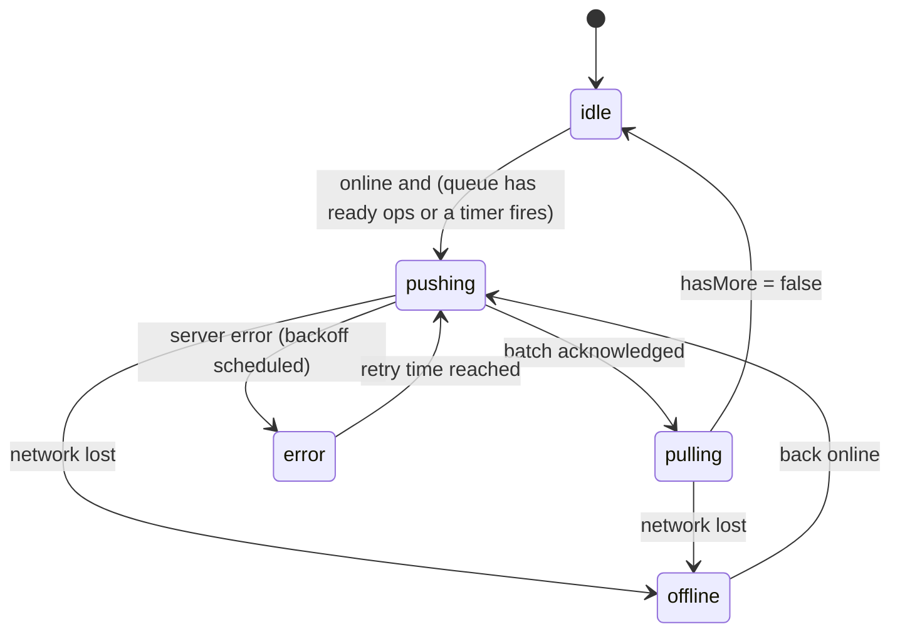
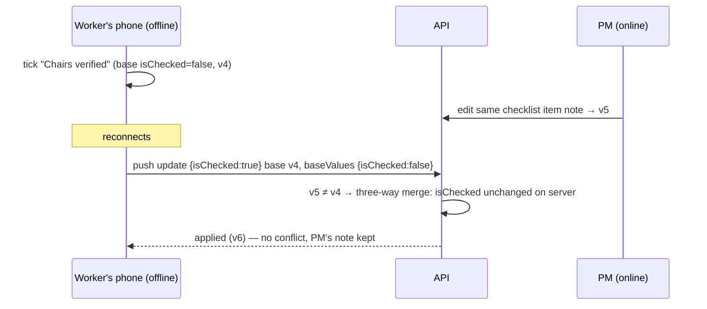
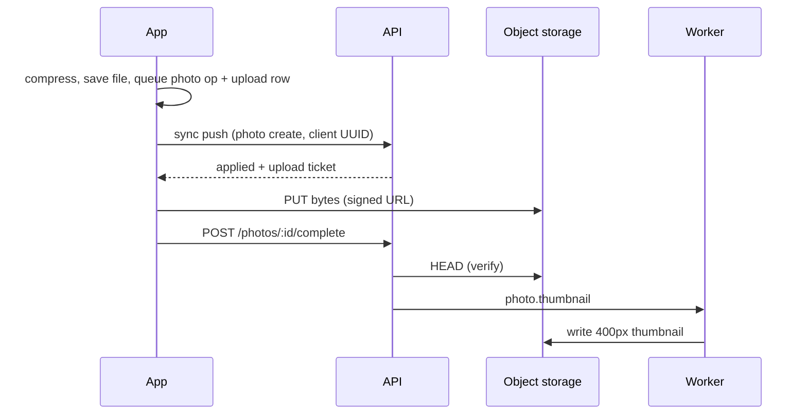

# Offline-first and sync

Pool sites often have no signal. The rule: **every field action succeeds locally, immediately, and is never silently lost.** The server is the system of record; the device is a durable, partial replica that the user can always work against.

## On the device (`apps/mobile/src/lib/db/database.ts`)

| SQLite table | Holds |
|---|---|
| `records` | Every synced entity, keyed by `(type, id)` with `project_id`, `parent_id`, `sort_key`, `version`, `updated_at` and the JSON record. Screens query this through `features/data.ts`. |
| `sync_queue` | Durable outbound operations, in order (`seq`), with status, retry count, last error and conflict details |
| `meta` | Pull cursor and other sync bookkeeping |
| `uploads` | Photo files waiting to upload: local file, upload ticket, attempts, next attempt time |
| `offline_files` | Documents the user saved for offline viewing |

Small preferences (pinned projects, biometrics flag, cached profile) live in MMKV, with an in-memory fallback. Tokens live in SecureStore.

Writes go through `lib/mutations.ts`. Each mutation **upserts the local record and enqueues a `SyncOperation` in the same step**, then the UI shows "Saved on device". Live queries (`useLocalQuery`) re-run on change notifications, so every screen updates immediately.

## The sync engine (`packages/sync`)

`SyncEngine` is platform-agnostic. The app supplies a queue store, a local store, a transport (the API client) and a network monitor. It is unit-tested with in-memory implementations.

Behaviour:
- **Enqueue and coalesce** (`coalesce.ts`). A burst of offline edits to one entity collapses into one operation:
  - create + update → create
  - update + update → update (keeping the earliest base values)
  - create + delete → nothing
  - update + delete → delete
- **Causal order.** Operations for the same entity go out strictly in order. If an earlier op is failed or in conflict, later ops for that entity wait. Other entities keep flowing.
- **Push.** Ready ops are sent in batches (`POST /sync/push`). Results:
  - `applied`: the server record replaces the local one, and queued followers are rebased onto the new version.
  - `duplicate`: the op was already applied by an earlier attempt whose response was lost, so it is removed.
  - `conflict`: kept with the server record and the conflicting fields.
  - `rejected`: retryable codes back off; others become `failed`, with the server's message.
- **Backoff** (`backoff.ts`). Exponential from about 2 s, capped at 15 min, ±25 % jitter. After 12 automatic attempts an op becomes `failed` and waits for the user, so it is still never dropped.
- **Pull.** `POST /sync/pull` with the stored cursor, repeated while `hasMore`. Changes are applied to `records`, deletions remove the row, and the cursor is saved after each page. On the last page, projects missing from `accessibleProjectIds` are purged from the device (for example, the user was removed from a crew).
- **Triggers.** Sync runs on app start, on reconnect, after every local mutation (debounced), on foreground, on a timer, and on realtime hints.

### Conflicts: per-field three-way merge

Every update carries `baseVersion` and `baseValues`, the values of the changed fields **before** the local edit. When the server's version has moved on, it merges field by field (`packages/sync/src/merge.ts`, mirrored in `services/api/src/services/sync.ts`):

| Field state | Result |
|---|---|
| Server value still equals base | Apply mine |
| Server changed it to the same value as mine | Already consistent |
| Server changed it to something else | **Conflict** on that field |

Fields the device did not touch are never overwritten. When any field conflicts, the op is returned as `conflict` and the user resolves it in **Offline queue**:
- **keep mine**: rebased on the server version and re-sent
- **keep theirs**: the server record is applied locally and the op removed
- **merge**: field by field

Discarding a change is possible but explicit, behind a confirmation, and logged.

## On the server (`services/api/src/services/sync.ts`)

- **Idempotent push.** Every op id is recorded in `sync_operations` with its outcome. A retried op returns `duplicate` instead of being applied twice.
- **Same rules as REST.** Each op is dispatched to the same service function the REST endpoint uses, so permissions, validation, the checklist completion rule and activity logging are identical online and offline.
- **Client-generated IDs.** Records created offline keep their UUIDs, so follow-up ops and photos can reference them before the first sync.

### Pull cursor correctness

Every synced table has a `change_seq` from one global Postgres sequence, set by triggers on insert and update (migration `0001_sync_triggers.sql`). Paging by `change_seq` alone has a trap:
1. Transaction A draws seq 100 and stays open.
2. Transaction B draws seq 101 and commits.
3. A device pulls up to 101 and stores cursor 101.
4. A commits, but seq 100 is now behind the cursor and the device would never receive it.

The fix:
- Writers take a **shared** transaction-scoped advisory lock before drawing a seq.
- `sync_high_water_mark()` briefly takes the **exclusive** lock and reads the sequence. Holding it proves no writer is mid-transaction, so every seq ≤ the mark is committed.
- Pulls return only rows with `cursor < change_seq ≤ mark`.

### Role filtering and redaction

The pull uses the same row-level access as REST: the user's projects, and for subcontractors only their tasks. It also enforces internal/client visibility:
- Clients and subcontractors receive only client-visible stages, photos, documents, messages and activity.
- Budget and expenses go only to roles with `budget:read`; labor goes only to roles with `labor:read`, otherwise the user's own entries.
- Change orders are redacted for clients (no cost or labor impact).

Any user can pin a subset of projects in Settings to limit device storage; the device then pulls with `projectIds`.

## Photos and files (`apps/mobile/src/lib/sync/uploads.ts`)

1. The camera compresses the image (longest edge 2560 px, JPEG 0.8) and copies it into app storage. A `photo` create op is queued, and an `uploads` row is set to `waiting_metadata`.
2. When the create op is applied, the server returns a signed upload ticket and the row becomes `ready`.
3. The upload manager `PUT`s the file straight to object storage: `FileSystem.uploadAsync` streams it from disk on native, and `fetch` sends it on web.
4. `POST /photos/:id/complete`. The server verifies the object (`HEAD`), marks it `uploaded` and queues a thumbnail.

Failures back off (about 10 s, doubling, up to 30 min) and retry indefinitely; an expired ticket is renewed (`/photos/:id/upload-url`). The local copy stays in app storage, so the photo shows immediately and offline, with an "uploading" badge until it is done.

## Network detection (`lib/sync/network.ts`)

- **Native**: NetInfo, with reachability defined as "can reach **our** API" (`GET /health`), not a third-party site. Captive portals and blocked networks count as offline.
- **Web**: the browser's `online`/`offline` events. NetInfo's web implementation misses some reconnects.

## What the user sees

| Situation | Indicator | What to do |
|---|---|---|
| Never synced on this device | "Downloading data" / "Not synced yet" | Wait for the first sync; needs a connection once |
| Online, nothing pending | "Synced 2 min ago" | — |
| Offline | "Offline · 3 saved on device" | Keep working; changes upload on reconnect |
| Waiting to upload | "3 waiting to sync" | Nothing; retries automatically |
| Conflict or permanent failure | "2 need attention" (red) | Open the **Offline queue**, then resolve, retry or (explicitly) discard |
| Per record | "Saved on device" / "Sync failed" / "Conflict" badges | Tap through to the queue |
| Removed from a project | The project disappears after the next sync | Ask the PM for access |
| Signing out with unsynced changes | A warning: they upload when the same user signs back in, but are erased if a different account signs in on this device (local data is always reset on an account switch) | Sync first, or stay signed in |
